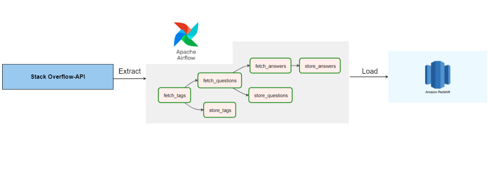
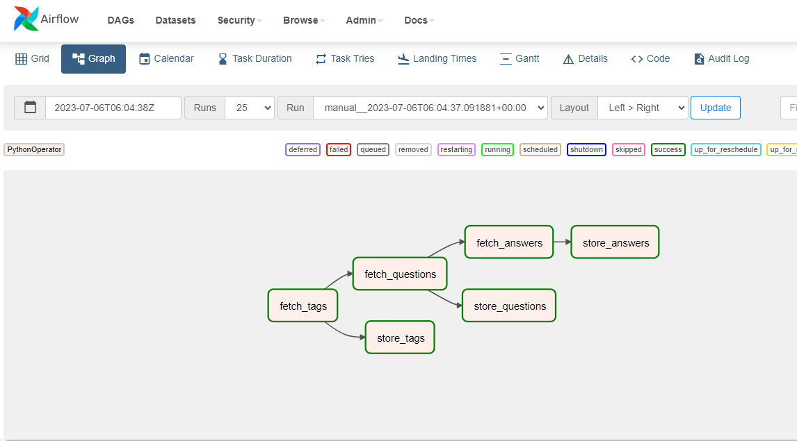
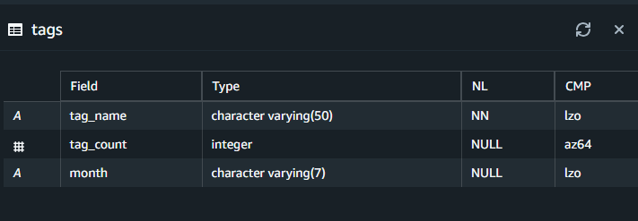
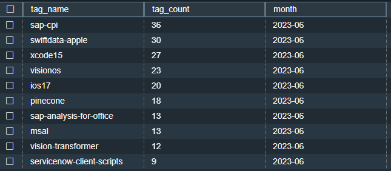
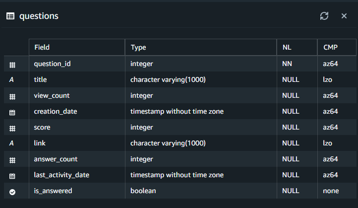
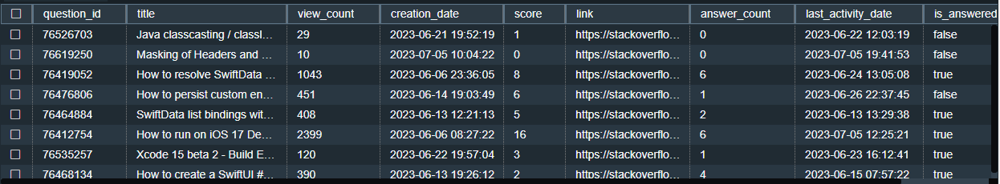
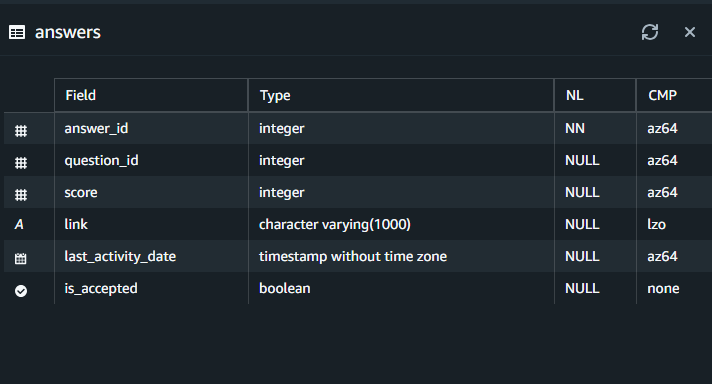
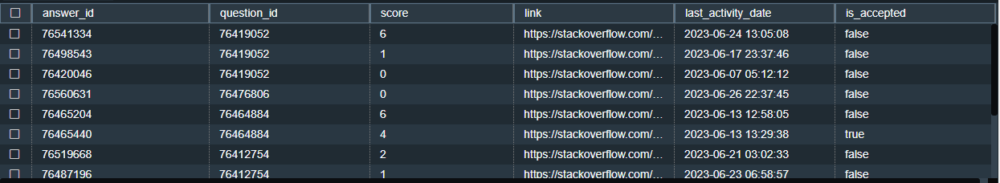

# StackOverflow_API-ETL

# Architecture

Architecture of fetching data from Stackoverflow API and loading into Amazon Redshift.

# Business Queries
* Top 3 all-time trending tags.
* Top 3 questions of all-time trending tags in last 30 days.
* Top 3 answers of each question above.

# Screenshots of DAG and Redshift tables.

